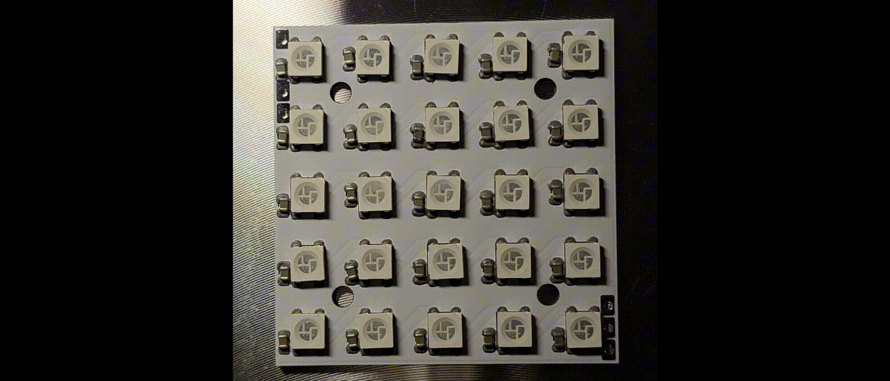

# Anweisungen für WS2812-Arrays

## Bestellung bei JLCPCB

Besuche [JLCPCB.com](https://jlcpcb.com/) oder einen Hersteller deiner Wahl (die Anweisungen sollten nahezu identisch funktionieren).

Navigiere zu **Products** → **FR4-PCBs** → **Get Instant Quote**

Lade die benötigten Gerber-Dateien als .zip hoch und warte, bis der Upload abgeschlossen ist. Nun solltest du eine Vorschau der hochgeladenen PCBs sehen.

### Einstellungen

Die ersten Einstellungen sollten automatisch gesetzt werden, überprüfe diese, da Fehler auftreten können:
- **Base Material:** FR-4
- **Layers:** 2
- **Dimensions:** (sollten die Anzahl der LEDs pro Seite*10mm sein, z. B. 2 × 2 -→ 20mm × 20mm)
- **PCB Qty:** Gib die benötigte Menge ein (*Hinweis:* Je mehr PCBs du bestellst, desto günstiger werden sie pro Einheit)
- **Product Type:** Industrial/Consumer electronics

#### PCB Specifications

- **Different Design:** 1
- **Delivery Format:** Single PCB
- **PCB Thickness:** 1.6mm wird bevorzugt, um eine optimale Wärmeableitung sicherzustellen, aber dünnere PCBs können gewählt werden, falls nötig
- **PCB Color:** Weiß für beste optische Eigenschaften
- **Silkscreen:** (wird automatisch gewählt)
- **Surface Finish:** HASL(with lead) oder LeadFree HASL (LeadFree wird wegen geringerer Toxizität empfohlen)

#### High-spec Options

- **Outer Copper Weight:** 1oz
- **Via Covering:** Tented
- **Via Plating Method:** Not Specified
- **Min via hole size/diameter:** 0.3mm/(0.4/0.45mm)
- **Board Outline Tolerance:** ±0.2mm(Regular)
- **Confirm Production file:** No
- **Mark on PCB:** Remove Mark
- **Electrical Test:** Flying Probe Fully Test
- **Gold Fingers:** No
- **Castellated Holes:** No
- **Edge Plating:** No
- **Blind Slots:** No
- **UL Marking:** No

#### Stencil

Da sich viele Bauteile auf einem PCB befinden, wird ein Stencil empfohlen. Aktiviere einfach **Stencil** unten.
- **Framework:** No
- **Step Stencil:** No
- **Nano-Coating:** No
- **Stencil Side:** Top only
- **Dimensions:** Wähle custom size und gib deiner PCB einen Rand von 10 oder 20mm (*Hinweis:* Stencils bis 100mm × 100mm kosten gleich viel, behalte das bei der Bestellung im Hinterkopf)
- **Stencil Qty:** 1
- **Thickness:** Select by JLCPCB
- **Stencil Process Type:** Solder Paste stencil
- **Polishing Process:** Sanding
- **Fiducials:** No Fiducial
- **Confirm Production file:** Yes (um sicherzustellen, dass keine Fehler aufgetreten sind)
- **Engrave Text:** No
- **Package Box:** With JLCPCB logo

**Fertig!**  
Speichere die Bestellung in deinem Warenkorb und füge weitere PCBs hinzu, wenn du möchtest.

*Hinweis:* Die Versandkostenschätzung ist nicht wirklich genau. Je nach Gewicht und Lieferzeit variieren die Versandkosten stark.

Wenn alle PCBs hinzugefügt wurden, nutze einfach den Checkout wie in jedem anderen Onlineshop.

*Hinweis:* Probiere verschiedene Versandmethoden aus und beachte, dass Steuern und Zoll bei einigen Methoden separat abgewickelt werden können. Ich empfehle *Global Standard Direct Line* oder *EuroPacket* für Lieferungen in die EU.

## Assembly

### Benötigte Ausrüstung und Bauteile

- **Heizplatte oder Reflow-Ofen** *Hinweis:* Eine alte Heißluftfritteuse funktioniert ebenfalls, benutze sie danach aber nicht mehr für Lebensmittel!
- **Lötpaste**
- **Kunststoffrakel oder alte Kreditkarte**
- **feine Pinzette**
- **Nitril- oder Latexhandschuhe**
- **Klebeband**
- **X × Y WS2812 LEDs**
- **X × Y 100µF Kondensatoren** (Diese werden nur benötigt, wenn sie im Datenblatt deiner LEDs erwähnt werden. Falls du dir unsicher bist, füge sie hinzu, da sie für eine bessere Datenübertragung vorteilhaft sind)

### Löten

#### 1. Eine Vorrichtung bauen

Baue eine Vorrichtung für die PCB, die du herstellen möchtest: Verwende eine flache Oberfläche, platziere deine PCB und ordne weitere PCBs darum herum an. Fixiere sie mit Klebeband.

#### 2. Stencil ausrichten

Richte dein Stencil aus und fixiere es auf einer Seite mit Klebeband.

#### 3. Lötpaste auftragen

Gib etwas Lötpaste auf dein Stencil und verteile sie gleichmäßig über alle Öffnungen, entferne überschüssige Paste.

#### 4. Stencil entfernen und Bauteile platzieren

Platziere deine Bauteile auf der frischen Lötpaste. *Hinweis:* Einige Bauteile haben eine eindeutige Ausrichtung, bitte platziere sie entsprechend.

#### 5. Reflow-Gerät erhitzen und PCB löten

Stelle die richtige Temperatur ein und platziere deine PCB in/auf dein Reflow-Gerät. *Hinweis:* Wenn der Lötvorgang abgeschlossen ist, sind die PCBs heiß. Bitte sei vorsichtig, da sonst Verbrennungen/Verletzungen auftreten können!

#### 6. Verdrahten und testen

Zum Schluss kannst du deine fertigen PCBs verdrahten. Verwende sie, wie du möchtest, aber überschreite nicht die Grenzwerte der PCBs/Bauteile!

## Einfache Beispiele

Falls du etwas Inspiration oder ein einfaches Startskript brauchst, wirf einen Blick auf [scripts](https://github.com/kkitdesign/ws2812-array_de/tree/main/scripts)!

## Montage und Integration

Die Arrays können mit passenden Diffusoren mithilfe von M3-Schrauben kombiniert werden. Achte nur darauf, dass sie nicht zu lang sind und die Frontplatte beschädigen. Falls nötig, können die Diffusoren verwendet werden, um mehrere Arrays zu kombinieren. Platziere sie dazu einfach nebeneinander in deiner CAD-Software oder im Slicer.

Zur Montage der Arrays gibt es 3mm-Löcher genau 10mm von den Außenkanten entfernt. Die 8×8- und 10×10-Varianten haben zusätzlich ein Befestigungsloch in der Mitte, damit sich der Diffusor nicht nach außen biegt. Alle Löcher können verwendet werden, um die Diffusoren an deinem Projekt zu befestigen, aber ziehe sie nicht zu fest an und verwende eine Nylon-Unterlegscheibe, um Kratzer auf der Lötstoppmaske zu vermeiden. In Kombination mit Metallschrauben können Kurzschlüsse auftreten.

Für mechanische Zeichnungen besuche [mechanical](https://github.com/kkitdesign/ws2812-array_de/tree/main/mechanical).